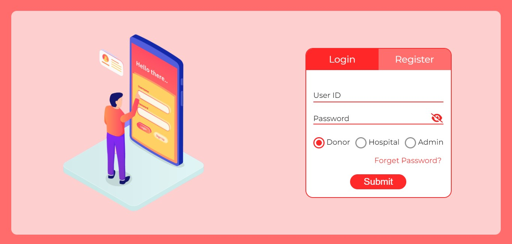
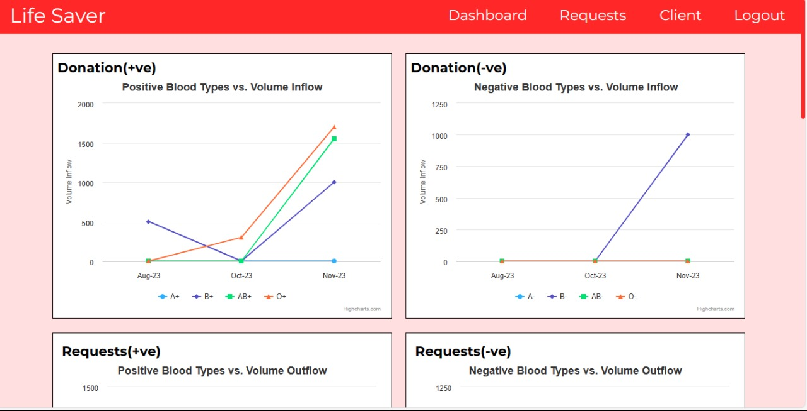

# Blood Bank Management System

The Blood Bank Management System is a comprehensive web-based platform designed to revolutionize the management of blood donations, requests, and inventory. This project aims to address the challenges and inefficiencies of existing blood bank management systems, such as outdated interfaces, manual processes, and lack of real-time coordination. By leveraging modern web technologies, we've created a dynamic solution that ensures seamless interaction and collaboration among users, ultimately enhancing the availability and accessibility of life-saving blood products.

## Features

**Tailored Login System:** A sophisticated three-type of login system caters to donors, hospitals, and administrators, providing each user group with personalized functionalities and intuitive interfaces.

**Enhanced Security Measures:** Robust registration and authentication mechanisms using OTP verification ensure secure access for all users, safeguarding sensitive information and maintaining data integrity.

**Efficient Donor Management:** Donors can effortlessly schedule appointments, access their donation history, and update profile details, streamlining the blood donation process.

**Streamlined Hospital Management:** Hospitals facilitate seamless blood request submissions, efficient recipient record management, and effortless blood group searches, enhancing patient care delivery.

**Effective Blood Inventory Management:** The system efficiently tracks blood donations, manages inventory levels, and facilitates timely distribution to meet the demands of healthcare facilities.

**Proactive Notification System:** Dynamic notification system delivers instant alerts to donors, hospitals, and administrators, keeping them informed about blood requests, donations, and inventory updates in real-time.

**Administrative Oversight:** The admin panel grants administrators comprehensive control over user management, system monitoring, and report generation, empowering administrators with advanced analytics and reporting tools to monitor system performance, analyze trends, and derive actionable insights for informed decision-making.

## User Actions

### Donor

**Register and Profile Creation:** Seamlessly register as a donor and craft a comprehensive profile, including personal details, blood type, and donation history.

**Appointment Scheduling:** Effortlessly schedule blood donation appointments and receive timely reminders and notifications regarding your donation status.

**Donation Tracking:** Easily monitor your donation history and access insightful statistics to track your impactful contributions.

**Donation Certification:** Upon successful donation, receive a prestigious Donation Certificate as a token of appreciation

### Hospital

**Registration and Profile Establishment:** Swiftly register as a hospital entity and establish a robust profile, furnishing essential hospital and blood bank particulars.

**Blood Donation Requests:** Efficiently solicit blood donations from donors and stay updated in real-time with dynamic updates on donation statuses and availability.

**Patient Management:** Streamline patient management operations by seamlessly adding and tracking patient information within the dedicated hospital section.

### Administrator

**User Management:** Seamlessly manage the accounts of donors, hospitals, and fellow administrators, exercising granular control over permissions and access levels.

**System Oversight and Analytics:** Diligently monitor system performance, leveraging advanced analytics to generate comprehensive reports on donation history, inventory levels, and user engagement metrics.

**Customization and Configuration:** Tailor the system to organizational needs by configuring system settings and fine-tuning the user interface and functionalities to optimize user experience and operational efficiency.

## Technologies

**Backend Framework:** Flask powers the backend, offering a lightweight and flexible architecture for web development.

**Database System:** SQLite ensures reliability and scalability for data storage and retrieval.

**Frontend Technologies:** HTML, CSS, and JavaScript come together to create a rich and interactive user interface.

**Frontend Framework:** Bootstrap enhances the frontend with a responsive and customizable design system.

**Data Visualization:** Chart.js adds depth to the user experience with powerful and flexible charts and graphs.

## Installation

1. Clone the repository: `git clone https://github.com/username/blood-bank-management-system.git`
2. Install the dependencies: `pip install -r requirements.txt`
3. Run the application: `python app.py`

## Usage

1. Website Link: https://lifesaver-uxlr.onrender.com/
2. Navigate to the registration page and create an account as a donor, hospital, or blood bank.
3. Log in with your credentials.
4. Explore the respective functionalities based on your user role.
5. Schedule appointments, request blood, manage records, and more.

## Screenshots

### Login Page

### OTP Verification Page

### Home Page

### Appointment Page

### Admin Dashboard

## License
This project is licensed under the Creative Commons Attribution-Non Commercial-No Derivatives 4.0 International (CC BY-NC-ND 4.0) license. You can use this project for learning purposes, but you cannot modify or distribute it without permission. See the LICENSE.md file for details.

## Acknowledgments

- [Flask Documentation](https://flask.palletsprojects.com/en/2.1.x/)
- [SQLite Documentation](https://www.sqlite.org/docs.html)
- [HTML Tutorial](https://www.w3schools.com/html/)
- [CSS Tutorial](https://www.w3schools.com/css/)
- [JavaScript Tutorial](https://www.w3schools.com/js/)
- [Bootstrap Documentation](https://getbootstrap.com/docs/5.1/getting-started/introduction/)
- [Chart.js Documentation](https://www.chartjs.org/docs/latest/)
